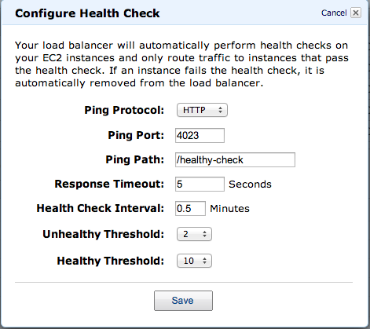

# Adx callback server

Node.js server using [Hapi framework](http://www.hapijs.com) to get callbacks from [Adx](http://www.ad-x.co.uk).

## Attributes sent

Adx sends the following attributes in a POST request. We save them to MySQL database:
* app
* idfa
* andi
* apid
* network_name
* campaign_name

## Instalation

Install ```hapi``` and the other dependencies (as listed in ```package.json```) from ```npm``` with command

```shell
npm install
```

The callbacks will be available with POST request on URL ```/callback```

Launch the application (```node .```) and run cURL with POST data:
```
curl -X POST http://localhost:8000/callback -d "idfa=132131&campaign_name=CampaignA&network_name=NetworkA"
```

## Healthy check

Since we are running this server on Amazon EC2 under a load balancer, it requires a healthy check to be set up. Our healthy check will connect to database and select last inserted row to see if the database connection can be established.

For this healthy check to work, you need to:

1. check table name in ```config.js``` - it should match the table name you are using to save the callbacks
2. set up healthy check in Amazon AWS load balancer. It is be available with GET request on URL ```/healthy-check```



## Config

Don't forget to create ```config.js``` file before you launch the application. You have two options:

1. copy ```config.template.js``` to ```config.js``` and update parameters
2. create a symlink to another directory with other config files, i.e. ```ln -s /srv/SecretConfig/production/config/config.adx.js ./config.js```

## Run it on a server

We recommend running it on a server with ```forever``` which is a great tool making sure it will run continuously, literaly, forever :-) See more info [about forever](https://github.com/nodejitsu/forever) in the documentation.

This is what we use to run it on our server:
```shell
forever start --minUptime 1000 --spinSleepTime 5000 /srv/nodejs/Adx/index.js
```